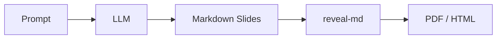

# AI Image Generation for Slides

> Research date: April 2026. Covers programmatic image and diagram generation options suitable for embedding in a slide generation pipeline.

---

## 1. Google Gemini Image Generation ("Nano Banana")

### What "Nano Banana" means

"Nano Banana" is Google's internal branding for Gemini's **native image generation** capability. It refers to a family of multimodal models that can produce images (and text) from a single API call — unlike Imagen, which is image-only.

As of April 2026, the Nano Banana model lineup is:

| Model ID | Nickname | Notes |
|---|---|---|
| `gemini-2.5-flash-image` | Nano Banana | Fastest; generous free tier |
| `gemini-3.1-flash-image-preview` | Nano Banana 2 | 4K support, 14 reference images, better text |
| `gemini-3-pro-image-preview` | Nano Banana Pro | Highest quality; professional asset production |

### Key capabilities

- Text-to-image and image-to-image (edit with natural language)
- Multi-turn conversational editing (ask follow-up refinements)
- Up to 14 reference images for style/character consistency
- Aspect ratios: 1:1, 16:9, 9:16, 4:3, 3:4, 21:9, and more
- Resolutions: 512px up to 4K
- Grounding with Google Search (reference real events/places)
- High-fidelity text rendering in images (significantly better than older models)

### Pricing (approximate, April 2026)

| Model | Cost per image |
|---|---|
| `gemini-2.5-flash-image` | ~$0.039 |
| `gemini-3.1-flash-image-preview` | ~$0.045 |
| `gemini-3-pro-image-preview` | ~$0.134 |
| Free tier | Up to 500 req/day on `gemini-2.5-flash-image` |

### Python API example

```python
from google import genai
from google.genai import types
import base64

client = genai.Client()  # uses GOOGLE_API_KEY env var

response = client.models.generate_content(
    model="gemini-2.5-flash-image",
    contents="Create a clean, professional infographic icon showing a data pipeline: "
             "three connected boxes labeled 'Input', 'Process', 'Output'. "
             "White background, blue color scheme, minimal flat design.",
    config=types.GenerateContentConfig(
        response_modalities=["TEXT", "IMAGE"]
    )
)

for part in response.candidates[0].content.parts:
    if part.inline_data is not None:
        with open("slide_image.png", "wb") as f:
            f.write(base64.b64decode(part.inline_data.data))
        print("Image saved to slide_image.png")
    elif part.text:
        print("Model note:", part.text)
```

### JavaScript / Node.js example

```javascript
import { GoogleGenAI } from "@google/genai";
import fs from "fs";

const ai = new GoogleGenAI({ apiKey: process.env.GOOGLE_API_KEY });

const response = await ai.models.generateContent({
  model: "gemini-2.5-flash-image",
  contents: "Generate a slide background: abstract geometric shapes, corporate blue palette, minimal",
  config: { responseModalities: ["TEXT", "IMAGE"] },
});

for (const part of response.candidates[0].content.parts) {
  if (part.inlineData) {
    const buffer = Buffer.from(part.inlineData.data, "base64");
    fs.writeFileSync("background.png", buffer);
  }
}
```

### REST API endpoint

```
POST https://generativelanguage.googleapis.com/v1beta/models/gemini-2.5-flash-image:generateContent
Authorization: Bearer YOUR_API_KEY
Content-Type: application/json

{
  "contents": [{"parts": [{"text": "A slide illustration of..."}]}],
  "generationConfig": {"responseModalities": ["TEXT", "IMAGE"]}
}
```

### Firebase AI Logic integration

Firebase AI Logic wraps the same API with Firebase Auth and per-user quota management, useful for web apps where slides are generated client-side:

```javascript
// Firebase Web SDK
import { getAI, getGenerativeModel, GoogleAIBackend } from "firebase/ai";

const ai = getAI(firebaseApp, { backend: new GoogleAIBackend() });
const model = getGenerativeModel(ai, {
  model: "gemini-2.5-flash-image-preview",
  generationConfig: { responseModalities: ["TEXT", "IMAGE"] },
});
const result = await model.generateContent("Create a slide hero image for a keynote about AI trends 2026");
```

---

## 2. Gemini CLI for Image Generation

### What Gemini CLI is

[Gemini CLI](https://github.com/google-gemini/gemini-cli) is an open-source terminal agent from Google. It provides conversational access to Gemini models with file access, shell execution, and web fetching built in.

**Installation:**
```bash
npm install -g @google/gemini-cli
# or
brew install gemini-cli
```

**Basic usage:**
```bash
gemini                          # interactive REPL
gemini -p "summarize this.md"   # non-interactive
gemini -m gemini-2.5-flash      # specify model
```

**Free tier:** 60 requests/minute, 1,000 requests/day with a personal Google account.

### Image generation via MCP servers

Gemini CLI does not natively generate images via its base commands. However, it supports **MCP (Model Context Protocol) servers** as tool plugins. Several MCP servers enable image generation from within Gemini CLI:

**Option A: Google GenMedia MCP (official experimental)**
- GitHub: `vladkol/gemini-cli-media-generation`
- Exposes Imagen 4, Veo 3, and Gemini 2.5 Flash Image via MCP tools
- Configured in `~/.gemini/settings.json`:

```json
{
  "mcpServers": {
    "genmedia": {
      "command": "npx",
      "args": ["-y", "genmedia-mcp-server"],
      "env": { "GOOGLE_API_KEY": "YOUR_KEY" }
    }
  }
}
```

**Option B: Community MCP servers**
- `mcp-server-gemini-image-generator` (Python): Text-to-image with intelligent filename generation
- `JimothySnicket/gemini-image-mcp`: Text-to-image, image editing, image processing

**Example workflow once MCP is configured:**
```
gemini> Generate a professional slide illustration: abstract data flow diagram, 
        teal and white color scheme, 16:9 aspect ratio, save as slide_03_diagram.png
```

### Limitations of Gemini CLI for image generation

- Image generation requires MCP server setup (not zero-config)
- Non-interactive scripting (`gemini -p "..."`) works but requires MCP to be pre-configured
- No native batch processing; images must be requested one at a time
- Better used as an interactive assistant than a pipeline component

---

## 3. Other Image Generation APIs

### OpenAI GPT Image (formerly DALL-E)

- **Status:** DALL-E 3 was deprecated March 2026. Current model is `gpt-image-1` (and `gpt-image-1.5`)
- **Quality:** Ranked #1 in 2026 benchmarks (Elo 1,284 on LM Arena)
- **Pricing:** ~$0.040/image standard, $0.080/image HD
- **API access:** Full REST API, Python SDK, Node SDK

```python
from openai import OpenAI
client = OpenAI()

response = client.images.generate(
  model="gpt-image-1",
  prompt="Professional slide background: gradient from deep blue to teal, subtle geometric pattern, 16:9",
  size="1792x1024",
  quality="hd",
)
image_url = response.data[0].url
```

- **Best for:** Production pipelines needing consistent, high-quality photorealistic output
- **Slide use case:** Hero images, background textures, illustrative photography

### Stable Diffusion (Self-hosted or API)

- **Models:** Stable Diffusion 3.5 Large (8B), Medium (2.5B, runs on consumer GPU with ~10GB VRAM), Large Turbo (speed variant)
- **API providers:** Stability AI API, Replicate, Hugging Face Inference Endpoints, Together AI
- **Pricing:** Free if self-hosted; $0.025–$0.065 via API depending on resolution and provider
- **Key advantage:** Fully offline, fully controllable, no content restrictions on self-hosted instances

```python
# Via Stability AI API
import requests, base64

response = requests.post(
    "https://api.stability.ai/v2beta/stable-image/generate/core",
    headers={"Authorization": f"Bearer {API_KEY}", "Accept": "image/*"},
    files={"none": ""},
    data={
        "prompt": "Minimalist slide icon: interconnected nodes, network graph, white background",
        "output_format": "png",
        "aspect_ratio": "16:9",
    },
)
with open("icon.png", "wb") as f:
    f.write(response.content)
```

- **Best for:** Pipelines needing cost control, custom fine-tuned models, or offline operation

### Midjourney

- **Status:** No official API as of April 2026. V7 (released April 2025) is the current model.
- **Access:** Discord bot only; unofficial API wrappers exist but violate ToS
- **Verdict:** Not suitable for programmatic slide pipelines. Use Flux 2 or GPT Image instead.

### Flux 2 (Black Forest Labs)

- **Models:** Flux 2 Pro v1.1 ($0.055), Flux 2 Pro ($0.045), Flux 2 Dev ($0.025)
- **Dev/Schnell variants:** Open weights, self-hostable, 40% market share in image gen as of 2026
- **API access:** Replicate, Together AI, WaveSpeedAI, Hugging Face
- **Best for:** Professional photography, marketing visuals, style-consistent illustration

### Ideogram 2.0

- **Specialty:** Industry-leading text rendering in images — ideal for slide content that needs readable labels, titles, or captions baked into the image
- **Pricing:** ~$0.040/image
- **API access:** REST API at `api.ideogram.ai`
- **Best for:** Infographic elements, labeled diagrams, "title card" imagery with text

---

## 4. Text-to-Diagram Tools (No Image Generation Needed)

For many slide use cases, a rendered diagram is more appropriate than a raster image. These tools convert text/code to diagrams natively embeddable in Markdown.

### Mermaid.js

**Best choice for broad ecosystem support.** Mermaid is rendered natively by GitHub, GitLab, Notion, HackMD, Obsidian, Quarto, Slidev, and Marp (with plugin).

**Supported diagram types:** Flowchart, sequence, Gantt, class, ER, state, pie, quadrant, journey, git graph, C4 context, mindmap, timeline, block, packet, kanban.

**Embedding in Markdown:**
````markdown

````

**CLI rendering to SVG/PNG:**
```bash
npx mmdc -i diagram.mmd -o diagram.svg
npx mmdc -i diagram.mmd -o diagram.png -w 1600 -H 900
```

**LLM generation:** Claude, GPT, and Gemini all generate valid Mermaid syntax reliably. The syntax is simple enough that an LLM can produce it from a natural language description with minimal error rate.

**Caveat (2025):** Mermaid's layout algorithm sometimes produces suboptimal node placement for complex graphs. For large diagrams, D2 or Graphviz may be better.

### D2

A newer, Go-based diagram language with a more expressive syntax and better layout algorithms than Mermaid.

**Key advantages over Mermaid:**
- Multiple layout engines: dagre, ELK, TALA (commercial auto-layout)
- Markdown-in-nodes, code in nodes, icon support
- Much better for complex architecture diagrams
- Cleaner, more readable DSL

```d2
# Architecture diagram
api: API Gateway {
  shape: rectangle
  style.fill: "#E8F4FD"
}
llm: LLM Engine {
  shape: cylinder
}
slides: Slide Renderer
api -> llm: "prompt"
llm -> slides: "markdown"
```

**CLI:**
```bash
d2 diagram.d2 output.svg
d2 --theme 200 diagram.d2  # dark theme
d2 --layout elk diagram.d2 # better layout for complex graphs
```

**LLM generation:** Less common in LLM training data than Mermaid, so prompt engineering may need examples. Still reliable for simple to moderate diagrams.

### PlantUML

**Status (2025–2026):** draw.io is phasing out PlantUML support in its online version. PlantUML is in maintenance mode; Mermaid has largely taken its mindshare. Use for UML-specific diagrams (class, sequence, component) where precise UML notation matters.

**CLI rendering:**
```bash
java -jar plantuml.jar diagram.puml
# or via Kroki API (no local Java needed):
curl -s "https://kroki.io/plantuml/svg/" \
  --data-urlencode "code=@diagram.puml" > diagram.svg
```

### Kroki (Unified API)

Kroki is a hosted (or self-hostable) service that renders 30+ diagram formats via a single HTTP API: Mermaid, D2, PlantUML, Graphviz, BPMN, C4, Excalidraw, Vega, and more.

```bash
# Render any diagram type via Kroki
curl -s "https://kroki.io/mermaid/svg" \
  -H "Content-Type: text/plain" \
  -d "flowchart LR; A-->B-->C" > diagram.svg
```

This is valuable in a slide pipeline where the LLM chooses the best diagram type per slide and the renderer handles it uniformly.

---

## 5. SVG Generation by LLMs

LLMs can generate SVG code directly from descriptions. This is increasingly viable as of 2025.

**Research state (2025):**
- **OmniSVG** (NeurIPS 2025): First end-to-end multimodal SVG generator using VLMs; handles icons through anime-style characters
- **LLM4SVG** (CVPR 2025): Fine-tuned models for complex vector graphic generation; SVGX-SFT-1M training dataset
- **Chat2SVG** (CVPR 2025): LLM generates SVG template from primitives, then image diffusion model adds detail
- **StarVector** (HuggingFace): Vectorizes icons, logos, technical diagrams from images
- **Reason-SVG**: Treats SVG as code generation; improves speed and editability

**Practical approach with current frontier LLMs (Claude, GPT-4o):**

Claude and GPT-4o can generate reasonable SVG for:
- Simple icons (arrows, shapes, minimal illustrations)
- Data visualizations (bar charts, timelines)
- Architectural diagrams (boxes and arrows)
- Decorative slide elements

For complex illustrations, generated SVG quality is unreliable. Combine with image APIs for photorealistic content.

**Example prompt pattern:**
```
Generate an SVG icon for a slide about machine learning pipelines.
Requirements:
- 200x200px viewBox
- Clean, minimal flat design
- Three connected circular nodes with arrows
- Color scheme: #2563EB (blue) for nodes, #94A3B8 (gray) for arrows
- No text labels (will be added by the slide layout)
Output only valid SVG code, no explanation.
```

**Integration in slides:**
- SVG can be inlined directly in Marp/reveal-md Markdown via `` or saved as `.svg` files and referenced normally

---

## 6. Practical Integration Patterns for a Slide Pipeline

### Pattern A: Inline Diagrams (No External Image APIs)

Best for technical/developer presentations. All visuals are text-based diagrams rendered at build time.

```
LLM generates .md file
  └── Contains mermaid/d2 code blocks for diagrams
CLI renders diagrams to SVG/PNG
  └── mmdc, d2, or Kroki API
Slide tool compiles final deck
  └── reveal-md or Marp
```

**Pros:** Fully offline after tool install; version-controllable; no API costs; LLMs are good at generating diagram code.

### Pattern B: Prompt-Generated Raster Images

For presentations needing photorealistic imagery, illustrations, or styled backgrounds.

```
LLM generates slide content + image prompts
  └── Each slide's image described in YAML/JSON sidecar
Image generation loop
  └── For each slide: call Gemini/Flux/GPT-Image API
  └── Save PNG/JPEG to assets/ directory
Slide tool compiles with local image references
  └── marp --theme brand-theme.css slides.md
```

**Prompt engineering tip:** Include slide position context in image prompts:
```python
image_prompt = f"""
Slide {slide_number} of {total_slides}: "{slide_title}"
Create a {position} image for this slide.
Style: {deck_style_guide}
Content context: {slide_summary}
Technical requirements: {aspect_ratio}, {color_palette}, white background
"""
```

### Pattern C: Hybrid (Diagrams + Generated Images)

The most robust approach: use diagram tools for structural/technical content, image APIs for hero/background/illustration needs.

```yaml
# Slide manifest generated by LLM
slides:
  - id: 1
    type: title
    image_type: generated
    image_prompt: "Abstract AI neural network, dark blue, heroic"
  - id: 2
    type: architecture
    image_type: diagram
    diagram_format: mermaid
    diagram_code: "flowchart LR; A-->B"
  - id: 3
    type: content
    image_type: none
```

### Pattern D: Multi-Agent Pipeline

See `harness-architecture-patterns.md` for full multi-agent design. Image generation fits naturally as a specialized subagent:

- **Content agent:** Generates slide text + image prompts
- **Image agent:** Calls image API, saves files, returns asset paths
- **Layout agent:** Assembles final Markdown with correct image references
- **QA agent:** Reviews rendered output, flags layout issues

### Caching and cost control

```python
import hashlib, os

def cached_image(prompt: str, model: str = "gemini-2.5-flash-image") -> str:
    """Generate or retrieve cached image. Returns local file path."""
    cache_key = hashlib.sha256(f"{model}:{prompt}".encode()).hexdigest()[:16]
    cache_path = f"assets/cache/{cache_key}.png"
    
    if os.path.exists(cache_path):
        return cache_path  # reuse existing
    
    # Generate via API
    image_bytes = call_image_api(prompt, model)
    os.makedirs("assets/cache", exist_ok=True)
    with open(cache_path, "wb") as f:
        f.write(image_bytes)
    return cache_path
```

This avoids re-generating identical images across iterative deck revisions.

---

## Summary Recommendations

| Need | Best Tool | Cost |
|---|---|---|
| Free, fast, slide illustrations | Gemini 2.5 Flash Image (free tier) | Free up to 500/day |
| Highest quality raster images | GPT Image 1.5 | ~$0.04/image |
| Self-hosted, no API costs | Stable Diffusion 3.5 + local GPU | Hardware cost only |
| Technical diagrams in Markdown | Mermaid.js | Free |
| Complex architecture diagrams | D2 | Free |
| Text-in-images (infographics) | Ideogram 2.0 | ~$0.04/image |
| All diagram types, one API | Kroki (self-hostable) | Free |
| Simple icons/shapes in slides | LLM-generated SVG | API call cost only |

---

## Sources

- [Gemini Image Generation docs – Google AI for Developers](https://ai.google.dev/gemini-api/docs/image-generation)
- [Nano Banana / Gemini 2.5 Flash Image Guide – DataCamp](https://www.datacamp.com/tutorial/gemini-2-5-flash-image-guide)
- [Generate images using Gemini – Firebase AI Logic](https://firebase.google.com/docs/ai-logic/generate-images-gemini)
- [Gemini CLI GitHub](https://github.com/google-gemini/gemini-cli)
- [Gemini CLI Media Generation MCP – GitHub](https://github.com/vladkol/gemini-cli-media-generation)
- [Launching gemini-imagen CLI – DEV Community](https://dev.to/aviad_rozenhek_cba37e0660/how-i-built-gemini-imagen-a-cli-for-google-gemini-image-generation-3pnd)
- [Complete Guide to AI Image Generation APIs 2026 – WaveSpeedAI](https://wavespeed.ai/blog/posts/complete-guide-ai-image-apis-2026/)
- [OpenAI Image Generation API docs](https://platform.openai.com/docs/guides/image-generation)
- [Creating Slides with Assistants API and image gen – OpenAI Cookbook](https://developers.openai.com/cookbook/examples/creating_slides_with_assistants_api_and_dall-e3)
- [OmniSVG – NeurIPS 2025](https://github.com/OmniSVG/OmniSVG)
- [LLM4SVG – CVPR 2025](https://github.com/ximinng/LLM4SVG)
- [Text to Diagram Tools Comparison 2025](https://text-to-diagram.com/?example=text)
- [Mermaid.js revisited – Korny's Blog, 2025](https://blog.korny.info/2025/03/14/mermaid-js-revisited)
- [Kroki unified diagram API](https://kroki.io/)
- [7 Best Midjourney APIs 2026 – APIframe](https://apiframe.ai/blog/best-midjourney-apis)
